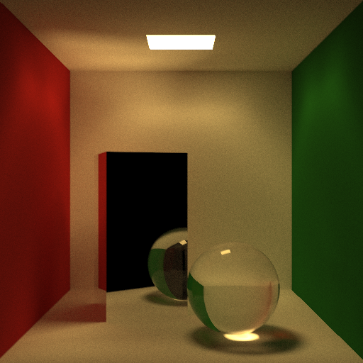

# Rust Raytracer

Figured a raytracer would be a fun way to learn how to use Rust.

## Dependencies
* Rust and Cargo. Just install `rustup` from [here](https://www.rust-lang.org/tools/install) and it'll install the whole Rust toolchain.

## How to build and run
Run `cargo build` or `cargo build --release` if you just want to compile without running.

In `src/main.rs` there are currently two available scenes you can render:
1. A basic scene with a diffuse sphere, a reflective sphere, a glass sphere, and a diffuse plane.
2. A [Cornell box](https://www.graphics.cornell.edu/online/box/data.html).
3. A thousand randomly generated spheres.
4. A [Stanford armadillo](http://graphics.stanford.edu/data/3Dscanrep/).

Just run `cargo run --release [1|2|3]` to render one of these.
(You can add `animate` at the end if you're rendering Scene 1 in particular to output a series of frames of an animated camera pivoting about the center of the scene to a subdirectory named `frames/`).

By default, this code will run on all available cores of your CPU.
You can go into `src/main.rs` and comment and uncomment particular lines of code (labelled appropriately) to change this.

## How to test
Run `cargo test` to run some basic sanity unit tests.

## What it looks like

The following images were produced (unless otherwise specified) using all 8 cores of my laptop's i7-8550U and a [bounding volume hierarchy](https://www.wikipedia.org/en/Bounding_volume_hierarchy) as an acceleration structure.

Below is an animation of a camera pivoting around a transparent ball with refractive index of 1.52, diffuse ball, reflective ball with roughness of 0.3, and diffuse plane.
120 frames of 640x480 images with 100 samples per pixel and a maximum of 50 bounces per ray took about 24 minutes (so ~12 seconds per frame):

Here's an image of 1,000 spheres, to show off how using an acceleration structure can dramatically improve performance.
This took about 24 seconds to render at 640x480 pixels, 100 samples, as opposed to about 3.65 minutes with a basic linear search:

Here's a golden [Stanford armadillo](http://graphics.stanford.edu/data/3Dscanrep/) (model obtained courtesy of [here](https://github.com/alecjacobson/common-3d-test-models)), loaded from the .obj inside the `models/` directory.
This model, which has 99,976 triangles, took about 19 seconds to render at 640x480, 100 samples:

And here's a few [Cornell box](https://www.graphics.cornell.edu/online/box/data.html) renders, all of which are 512x512 pixels with 10,000 samples per pixels and a maximum of 50 bounces.
The first two took ~1 hour and 10 minutes (as opposed to ~1 hour and 35 minutes without the BVH and just over 4 hours and 15 minutes on only one of those cores):

This one, with [Lucy and the Stanford bunny](http://graphics.stanford.edu/data/3Dscanrep/) (49,987 and 35,947 faces, respectively), took around 2 hours and 30 minutes.
However, to be fair, I was running multiple Chrome tabs as well as attending class over Zoom while rendering this, unlike the other images, so it probably would have been faster if left alone:

## How it works

TODO

## Resources

* [Ray Tracing in One Weekend](https://raytracing.github.io/books/RayTracingInOneWeekend.html)
* [Physically Based Rendering: From Theory to Implementation](https://pbrt.org/)
* [Cornell Box Data](https://www.graphics.cornell.edu/online/box/data.html)
* [Common 3D Test Models](https://github.com/alecjacobson/common-3d-test-models)
* [Wavefront .obj file](https://www.wikipedia.org/en/Wavefront_.obj_file)
* [Quaternions and spatial rotation](https://www.wikipedia.org/en/Quaternions_and_spatial_rotation)
* High school and college physics classes
